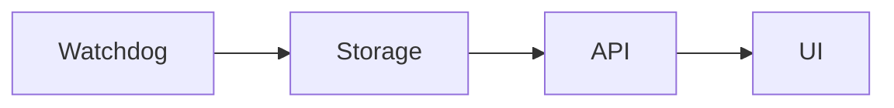

# VA-Connect Monitoring v2 Final Structure

This is the smallest working v2 layout.

The layout is intentionally shallow:

- one place for models
- one place for normalization
- thin routes only
- services contain logic
- no duplicated helpers

## Final Folder Structure

```text
va-connect-watchdog/
  docs/
    v2_data_models.md
    v2_final_structure.md
  tools/
    ubuntu/
      deploy/
        install_watchdog.sh
        update_watchdog.sh
        git_update_watchdog.sh
        bootstrap_watchdog_from_github.sh
        bootstrap_gateway_watchdog.sh
        restart_watchdog_services.sh
      runtime/
        process_watchdog.py
        site_watchdog.py
      shared/
        models.py
        normalization.py
        paths.py
        storage.py
        logging.py
        config.py
        time.py
      web/
        app.py
        routes.py
        services.py
        templates/
          index.html
        static/
          app.js
          app.css
      export/
        incident_export.py
        snapshot_export.py
```

## File Roles

### `docs/v2_data_models.md`

Defines the canonical incident, device status, and event models.

### `docs/v2_final_structure.md`

Defines the minimal folder layout and data flow for v2.

### `tools/ubuntu/deploy/install_watchdog.sh`

Installs files, systemd units, and required command wrappers.

### `tools/ubuntu/deploy/update_watchdog.sh`

Updates the installed code and restarts services.

### `tools/ubuntu/deploy/git_update_watchdog.sh`

Pulls the latest repo revision and re-runs deployment.

### `tools/ubuntu/deploy/bootstrap_watchdog_from_github.sh`

Clones the repo on a fresh machine and starts installation.

### `tools/ubuntu/deploy/bootstrap_gateway_watchdog.sh`

Performs the same bootstrap with extra gateway preflight checks.

### `tools/ubuntu/deploy/restart_watchdog_services.sh`

Restarts the live watchdog and web services.

### `tools/ubuntu/runtime/process_watchdog.py`

Small process watchdog for VA-Connect start and stop detection.

### `tools/ubuntu/runtime/site_watchdog.py`

Main monitoring loop.

Responsible for:

- running checks
- creating incidents
- writing events
- updating device status
- capturing snapshots
- recording recovery actions

### `tools/ubuntu/shared/models.py`

Defines the approved v2 data models.

This is the only place for canonical model shapes.

### `tools/ubuntu/shared/normalization.py`

Contains the only normalization layer.

Responsible for:

- validating incoming data
- filling defaults
- coercing timestamps
- enforcing allowed values
- standardizing checks and evidence items

### `tools/ubuntu/shared/paths.py`

Central place for file paths and directory names.

No other module should hard-code storage paths unless it is a very small startup script.

### `tools/ubuntu/shared/storage.py`

Shared read/write helpers for JSON, JSONL, and safe file access.

This replaces duplicated helper code across watchdog and web modules.

### `tools/ubuntu/shared/logging.py`

Shared event logging helpers.

Used to write the minimal event structure consistently.

### `tools/ubuntu/shared/config.py`

Shared config loading and defaulting.

Keeps config rules out of routes and business logic.

### `tools/ubuntu/shared/time.py`

Shared timestamp and boot-session helpers.

### `tools/ubuntu/web/app.py`

Creates the API application.

Should only wire the app together.

### `tools/ubuntu/web/routes.py`

Thin HTTP routes only.

Routes should:

- parse requests
- call services
- return responses

Routes should not contain business logic.

### `tools/ubuntu/web/services.py`

Contains the web-side logic.

Responsible for:

- reading incidents and device status
- preparing response payloads
- launching safe actions
- preparing downloads

### `tools/ubuntu/web/templates/index.html`

Single HTML entry template for the UI.

### `tools/ubuntu/web/static/app.js`

Client-side interaction and fetch logic.

### `tools/ubuntu/web/static/app.css`

UI styling.

### `tools/ubuntu/export/incident_export.py`

Builds incident export packs from canonical incident data.

### `tools/ubuntu/export/snapshot_export.py`

Builds snapshot packages or snapshot-related artifacts.

## Data Flow



### 1. Watchdog

The watchdog writes the canonical records:

- incidents
- device status
- events
- snapshots

It uses shared models and shared normalization before writing anything.

### 2. Storage

Storage is the source of truth on disk.

The watchdog writes to storage.
The web app reads from storage.

Storage should remain simple and explicit:

- JSON for state and models
- JSONL for event history
- files and folders for snapshots and exports

### 3. API

The API reads canonical records from storage through services.

The API does not re-derive incidents from raw logs.
The API does not duplicate normalization rules.
The API does not contain heavy logic in routes.

### 4. UI

The UI reads only API responses.

The UI should display:

- current device status
- recent incidents
- recent events
- snapshot and export links

The UI should not compute incident truth.

## Ownership Rules

### One place for models

- `tools/ubuntu/shared/models.py`

### One place for normalization

- `tools/ubuntu/shared/normalization.py`

### Thin routes only

- `tools/ubuntu/web/routes.py`

### Services contain logic

- `tools/ubuntu/web/services.py`
- `tools/ubuntu/runtime/site_watchdog.py`
- `tools/ubuntu/export/*.py`

### No duplicated helpers

Shared helpers belong in `tools/ubuntu/shared/`.

If a helper is needed in more than one place, it belongs there instead of being copied.

## What This v2 Removes

- giant all-in-one web rendering code
- duplicated status normalizers
- scattered path constants
- feature-specific ad hoc model shapes
- route logic mixed with business logic
- UI re-derivation of incidents from raw files

## Minimal v2 Baseline

The smallest useful v2 keeps only:

- process watchdog
- site watchdog
- incident model
- device status model
- event log model
- API endpoints for read and safe action flows
- a simple UI for status and review

Anything beyond that should be treated as optional later work, not part of the baseline.
