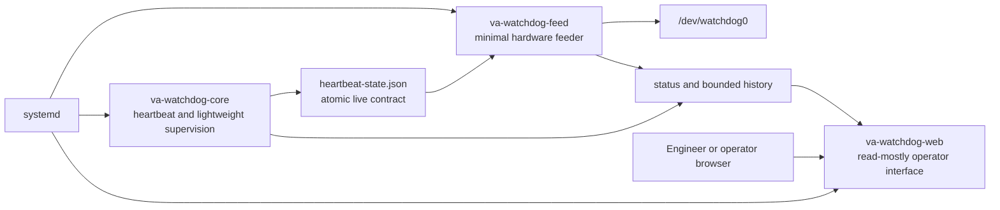
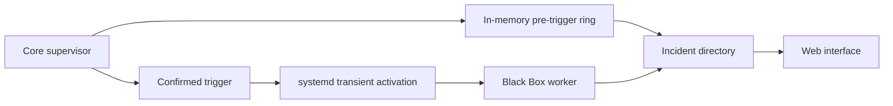
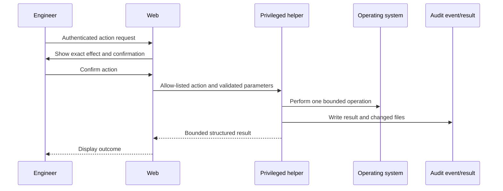

# Runtime Process Diagram

Status: Draft for approval

## Normal Operation

Normal process count: three.

## Incident Operation

Incident process count: four. The worker exits after post-event finalisation.

## Setup or Diagnostics Action

The helper is short-lived. It is not a fourth permanent service.

## Process Isolation Requirements

| Process | Restart policy | Failure isolation |
|---|---|---|
| Feeder | `on-failure` with short delay | Core, Web, and Black Box cannot own device |
| Core | `always` with bounded restart delay | Feeder grace prevents immediate reset during restart |
| Web | `on-failure` | No effect on heartbeat or feeding |
| Black Box | Incident-scoped retry policy | No effect on normal supervision |
| Helper | No automatic retry | Partial changes require explicit rollback result |

