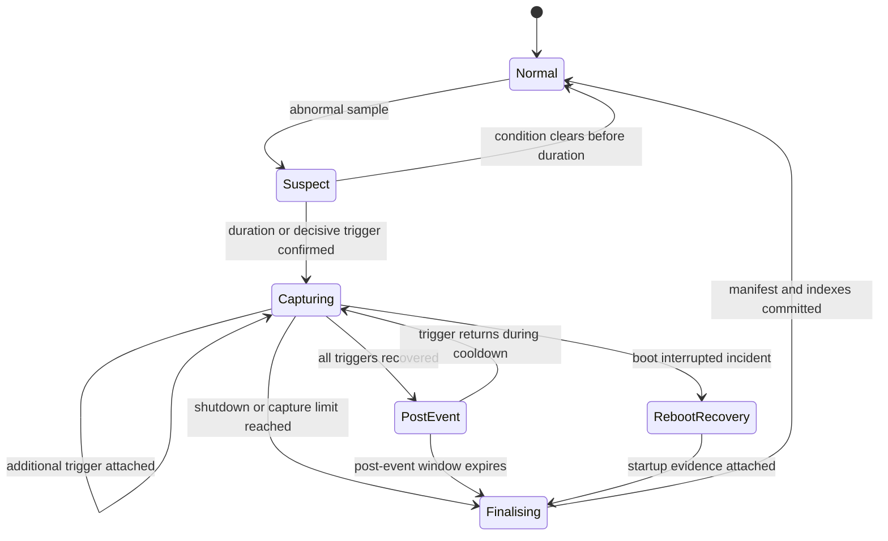

# Incident Lifecycle

Status: Draft for approval

## State Diagram

## 1. Pre-Trigger Buffer

Core keeps a bounded in-memory ring containing approximately 10-15 minutes of five-second lightweight samples. It is not continuously written as detailed evidence.

Each sample includes:

- UTC and monotonic timestamps.
- Boot ID and sequence.
- Overall and per-core CPU.
- Memory availability and pressure.
- I/O pressure.
- Core service states and resource summaries.
- Root and recording storage summaries.
- Interface state/error deltas.
- Core sample duration and lateness.
- Feed state summary.

## 2. Suspect

A non-decisive condition enters `suspect`. The trigger engine records:

- Trigger name.
- First observed monotonic time.
- Current value and threshold.
- Required duration.
- Recovery threshold.

The detailed worker is not started until confirmation. Decisive kernel faults, read-only filesystems, hardware feed errors, and severe sampling stalls may bypass duration confirmation.

## 3. Capture Start

When confirmed, Core:

1. Allocates a collision-resistant incident ID.
2. Writes an immutable incident manifest atomically.
3. Flushes the pre-trigger ring to the incident directory.
4. Records an incident-start event.
5. Starts one Black Box worker through systemd.
6. Exposes capture status to Web.

If worker activation fails, the incident remains open and records the failure. Core continues normal monitoring and may retry once after a cooldown.

## 4. Active Capture

The worker samples every 2-5 seconds according to the incident profile. Collector timeouts are shorter than the sampling interval. Slow collectors such as SMART or journal exports run on separate lower-frequency schedules.

Additional triggers are added to the incident manifest and may enable a specialised profile:

| Trigger class | Added evidence profile |
|---|---|
| CPU/scheduler | Threads, run queue, interrupts, context switches |
| Memory | Swap, page faults, OOM evidence, memory PSI |
| Storage/I/O | Block statistics, mount state, SMART, filesystem/kernel errors |
| Network | Interface counters, routes, neighbours, link and driver messages |
| Service | Process tree, threads, cgroup resources, service journal |
| Kernel | Kernel cursor stream and previous context |
| Watchdog timing | Core/feeder deadlines, heartbeat and scheduling evidence |

## 5. Recovery and Post-Event

An incident does not recover on a single healthy sample. Every trigger uses a recovery threshold and duration. Once all triggers recover, the state becomes `post_event`.

Detailed collection continues for a default 5-10 minutes. A returning trigger moves the same incident back to `capturing`.

## 6. Reboot During Incident

The open incident marker is an atomic file separate from worker output. On startup, Core:

1. Detects the boot ID change.
2. Reads the previous heartbeat and incident marker.
3. Collects previous-boot evidence where available.
4. Distinguishes reset mechanism from probable preceding fault.
5. Attaches reboot evidence to the open incident.
6. Finalises the interrupted incident with an evidence confidence.

No reset cause is marked definite without supporting evidence.

## 7. Finalisation

Finalisation produces:

- Incident start, end, and duration.
- Trigger and recovery timeline.
- Pre-trigger and post-event coverage.
- Reboot outcome where applicable.
- Collector success/failure inventory.
- Key findings without unsupported diagnosis.
- Evidence confidence.
- File manifest with sizes and hashes where practical.

Only after the atomic final index is written does the incident become eligible for retention.

## 8. Incident Limits

- Only one incident is active at a time.
- Maximum active duration is configurable and defaults to a bounded value.
- Evidence has per-incident and total size limits.
- Hitting a limit records the omitted data and reason.
- Open incidents are never silently purged.
- Manual capture uses the same lifecycle and is labelled `manual`.

