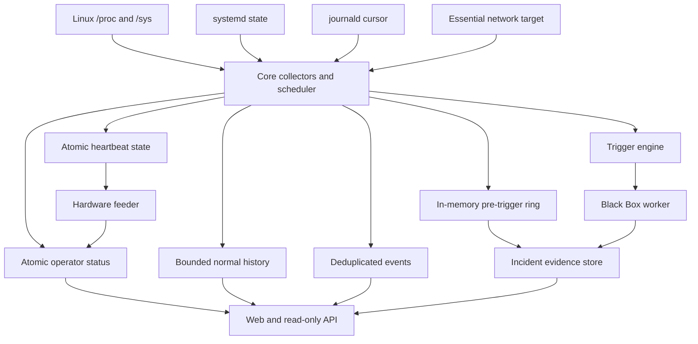
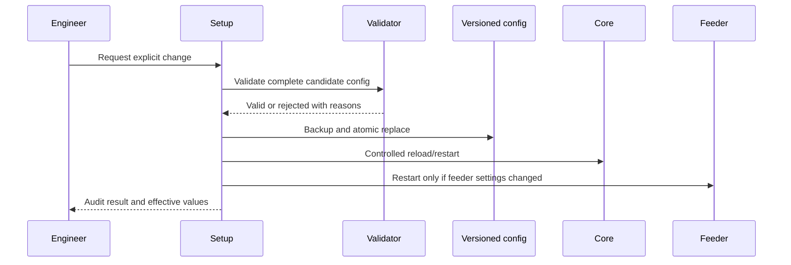

# Data Flow

Status: Draft for approval

## Overview

## Live Decision Data

Live decisions use atomic snapshots with schema versions:

| File | Writer | Reader | Purpose |
|---|---|---|---|
| `heartbeat-state.json` | Core | Feeder | Current-boot liveness using monotonic uptime |
| `feed-status.json` | Feeder | Core/Web | Feed state, timestamps, count, errors |
| `status.json` | Core | Web/API | Operator status and current evidence quality |
| `incident-active.json` | Core | Core/Worker/Web | Active incident identity and lifecycle state |
| `blackbox-status.json` | Worker | Core/Web | Worker progress and collector health |
| `control/feed.json` | Setup/trip action | Feeder | Expiring explicit control request |

Each snapshot contains a schema version, boot ID, sequence, UTC timestamp, and monotonic timestamp where relevant.

## Append-Only Evidence

| Data | Normal frequency | Retention purpose |
|---|---:|---|
| Heartbeat forensic history | bounded low-detail cadence | Establish final liveness before reboot |
| Events | state transitions only | Operator and incident timeline |
| Normal history | 60 seconds | Long-term context and pre-incident baselines |
| Reboot evidence | per boot transition | Explain reset mechanism and preceding findings |
| Incident samples | 2-5 seconds during incident | Detailed diagnosis |
| Incident kernel stream | Cursor-driven during incident | Preserve decisive OS evidence |

JSONL files are never used as control channels. Partial final lines are ignored safely by readers.

## Configuration Flow

Runtime state never silently rewrites policy configuration.

## Evidence Export Flow

Support bundle generation reads immutable snapshots and copies bounded tails or complete incident files. It must:

- Avoid blocking Core.
- Exclude CCTV recordings.
- Exclude credentials and secrets.
- Include configuration with sensitive fields redacted.
- Include a manifest of present and missing evidence.
- Record bundle generation as an audit event.

## Backpressure

- Atomic snapshots overwrite old state and therefore remain bounded.
- Append-only writers enforce maximum line size.
- Incident queues are bounded.
- A slow disk causes evidence degradation events rather than unbounded memory growth.
- Core retains liveness priority over status, history, and event writes.
- When evidence storage is exhausted, Core keeps heartbeat and minimal status operational.

